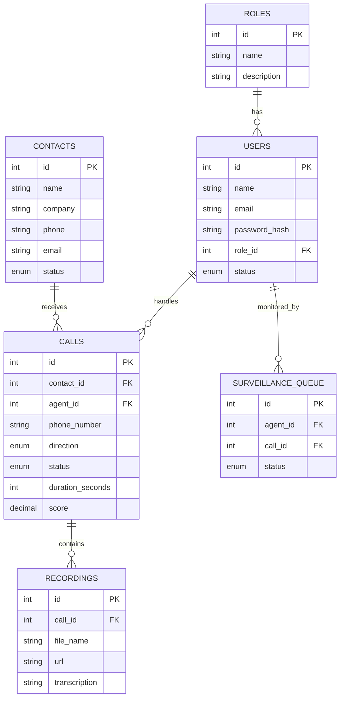

# Diagrama ER

```mermaid
erDiagram
  ROLES ||--o{ USERS : has
  USERS ||--o{ CALLS : handles
  CONTACTS ||--o{ CALLS : receives
  CALLS ||--o{ RECORDINGS : contains
  USERS ||--o{ SURVEILLANCE_QUEUE : monitored_by

  ROLES {
    int id PK
    string name
    string description
  }

  USERS {
    int id PK
    string name
    string email
    string password_hash
    int role_id FK
    enum status
  }

  CONTACTS {
    int id PK
    string name
    string company
    string phone
    string email
    enum status
  }

  CALLS {
    int id PK
    int contact_id FK
    int agent_id FK
    string phone_number
    enum direction
    enum status
    int duration_seconds
    decimal score
  }

  RECORDINGS {
    int id PK
    int call_id FK
    string file_name
    string url
    string transcription
  }

  SURVEILLANCE_QUEUE {
    int id PK
    int agent_id FK
    int call_id FK
    enum status
  }
```
